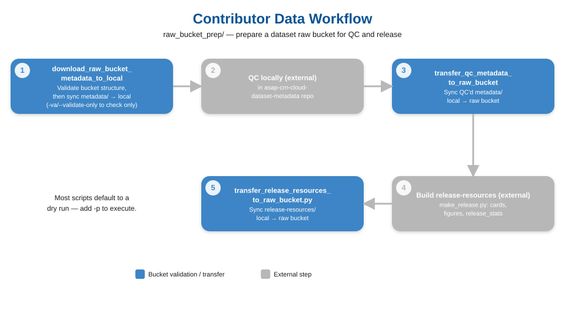
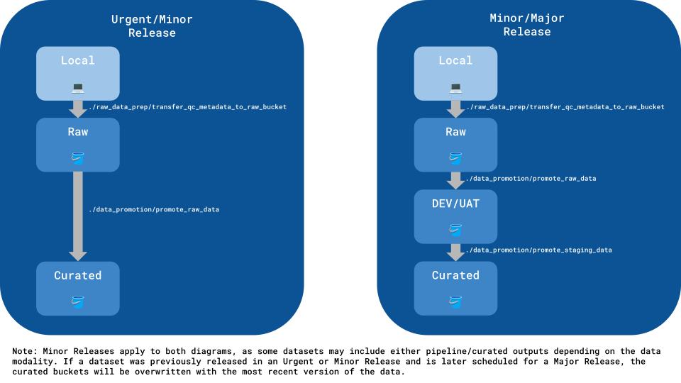
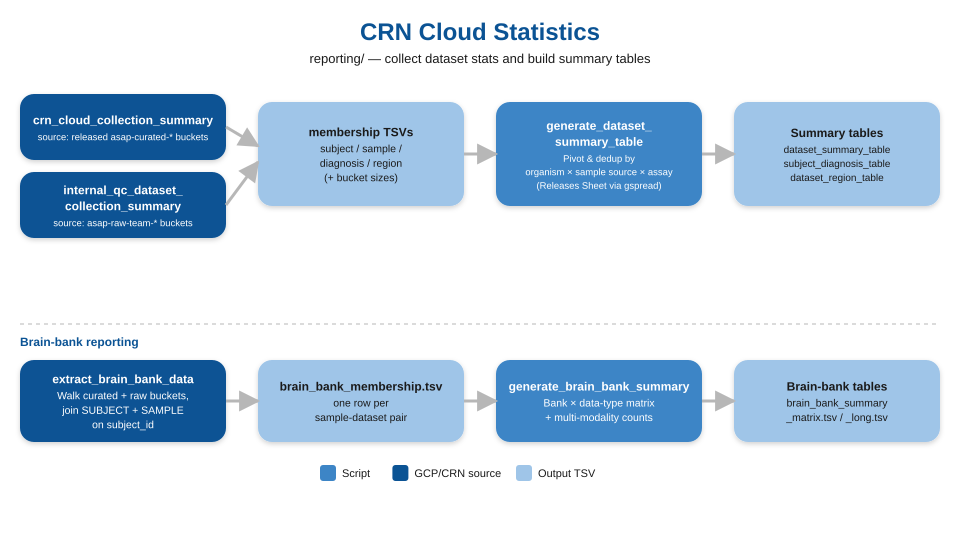

# util scripts

## Repository layout

```
util/
├── common/                  # shared helpers imported by other scripts
│   ├── gcloud_ops.py            # gcloud/storage CLI wrappers + bucket IAM/label ops
│   ├── release_ops.py           # Releases-Sheet loading, release constants, slug classifiers
│   ├── data_integrity.py        # manifest / MD5 / blob checks for staging→prod
│   ├── bucket_validation_utils.py
│   └── markdown_generator.py
├── raw_bucket_prep/         # prepare a dataset raw bucket for QC & release
│   ├── validate_raw_bucket_structure.py
│   ├── download_raw_bucket_metadata_to_local
│   ├── transfer_qc_metadata_to_raw_bucket
│   └── transfer_release_resources_to_raw_bucket.py
├── data_promotion/          # promote raw → staging → curated buckets
│   ├── promote_raw_data
│   ├── promote_staging_data
│   ├── clean_wdl_raw_buckets
│   ├── data_promotion_diagram.svg
│   └── archive/transfer_raw_data        # deprecated
├── reporting/               # collection summaries & dataset stat tables
│   ├── crn_cloud_collection_summary
│   ├── curated_metadata_summary.py  # per-dataset metrics helper for crn_cloud_collection_summary
│   ├── internal_qc_dataset_collection_summary
│   ├── generate_dataset_summary_table
│   ├── extract_brain_bank_data
│   └── generate_brain_bank_summary
├── workflow_inputs/         # build WDL inputs JSONs from team metadata
│   ├── common.py                # dataset ID parsing shared by the scripts below
│   ├── get_fastq_locs.py
│   ├── get_team_metadata.py
│   └── generate_inputs
└── requirements.txt
```

> Scripts in `raw_bucket_prep/`, `data_promotion/`, and `reporting/` import shared helpers from `common/` (`gcloud_ops`, `release_ops`, `data_integrity`) via a small `sys.path` bootstrap, so they still run directly from their subfolder.


| Script | Folder | Description | Context | Example usage |
| :- | :- | :- | :- | :- |
| [`gcloud_ops.py`](./common/gcloud_ops.py) | `common/` | Elementary `gcloud storage` CLI wrappers (copy/move/remove/rsync/list), bucket IAM and label operations, and bucket/dataset name-parsing helpers. | Centralizes the low-level Cloud Storage calls reused across the promotion and transfer scripts. | NA |
| [`release_ops.py`](./common/release_ops.py) | `common/` | Loads the live Releases Google Sheet (SSOT), derives release/bucket constants, and provides slug-based assay/organism/source classifiers. | Single source of truth for release metadata and dataset classification when Sheet data isn't available. | NA |
| [`data_integrity.py`](./common/data_integrity.py) | `common/` | Manifest reading and MD5 / non-empty / associated-metadata checks, plus staging-vs-curated blob name and hash comparisons. | Used to validate data integrity when promoting staging data to production. | NA |
| [`bucket_validation_utils.py`](./common/bucket_validation_utils.py) | `common/` | Functions to validate raw bucket and local metadata structure and contents before transferring data. | Checks preceding data transfers. | NA |
| [`file_utils.py`](./common/file_utils.py) | `common/` | General-purpose functions to parse file properties (e.g. size, extension). | Checks preceding data transfers. | NA |
| [`get_fastq_locs.py`](./workflow_inputs/get_fastq_locs.py) | `workflow_inputs/` | List every FASTQ in a dataset's raw bucket (`gs://asap-raw-<dataset_id>/fastqs/`). | Step 1 of [generating workflow inputs](#generating-workflow-inputs). Its output is read by `get_team_metadata.py`. | `python3 get_fastq_locs.py -d team-jakobsson-pmdbs-sn-rnaseq -o team_metadata` |
| [`get_team_metadata.py`](./workflow_inputs/get_team_metadata.py) | `workflow_inputs/` | Join team metadata CSVs with FASTQ locations to make the per-dataset project TSV. | Step 2 of [generating workflow inputs](#generating-workflow-inputs). Also applies per-dataset sample/pool/donor exclusions and sets `embargoed`. | `python3 get_team_metadata.py -m metadata -d team-jakobsson-pmdbs-sn-rnaseq -o team_metadata` |
| [`generate_inputs`](./workflow_inputs/generate_inputs) | `workflow_inputs/` | Generate inputs JSON for WDL pipelines. | Ability to generate the inputs JSON for WDL pipelines given a project TSV (sample information), inputs JSON template, workflow name, and cohort dataset ID. See [required project TSV columns](#3-generate_inputs-project-tsv-columns). | `./generate_inputs --project-tsv lee.metadata.tsv --inputs-template inputs.json --workflow-name sc_rnaseq_analysis --release-version v4.0.0 --cohort-dataset-id cohort-pmdbs-sc-rnaseq` |
| [`validate_raw_bucket_structure.py`](./raw_bucket_prep/validate_raw_bucket_structure.py) | `raw_bucket_prep/` | Extended validation of the raw bucket structure and file contents. Check for inconsitencies in sample, subject and file names across tables. Search empty files. Produce a MD report and reconciliation TSV files. | Use to Pre-QC a dataset or as part of the full QC pipeline. The MD outfile provides an Executive Summary with critical issues (if any) | `python3 validate_raw_bucket_structure.py -d team-smith-pmdbs-sc-rnaseq` |
| [`download_raw_bucket_metadata_to_local`](./raw_bucket_prep/download_raw_bucket_metadata_to_local) | `raw_bucket_prep/` | Validate the raw bucket structure, then sync raw bucket metadata to the local metadata directory. | Once authors have contributed their metadata to the raw bucket, this script first validates the bucket structure/metadata and then downloads the data locally so that QC can be performed. Pass `-v/--validate-only` to run just the structure/metadata checks without downloading (this replaces the former standalone `validate_raw_bucket_structure.py`). | `./download_raw_bucket_metadata_to_local -d team-jakobsson-pmdbs-bulk-rnaseq` (add `--validate-only` to check only) |
| [`transfer_qc_metadata_to_raw_bucket`](./raw_bucket_prep/transfer_qc_metadata_to_raw_bucket) | `raw_bucket_prep/` | Sync local metadata directory to the raw bucket. | After receiving author-contributed metadata from a raw bucket, QC/processing steps must be done locally. This script is run after QC is complete, so that the locally changed metadata directories are sync'd to the raw bucket. If any later changes are made to the metadata, this script will need to be re-run to ensure that the raw bucket contains the most up to date copies of the QC'd metadata. | `./transfer_qc_metadata_to_raw_bucket -d team-jakobsson-pmdbs-bulk-rnaseq -v v4.0.0`|
| [`promote_raw_data`](./data_promotion/promote_raw_data) | `data_promotion/` | Transfer QC'ed metadata, CRN Team contributed artifacts, and other CRN Team contributed data (e.g., spatial) from raw data buckets to staging (for Urgent releases) *or* production buckets (for Minor/Major releases). | Ability to transfer QC'ed metadata and CRN Team contributed data from raw buckets to staging/production buckets. This script is run for all releases: Urgent, Minor, and Major. It also removes the `internal-qc-data` label from the released raw buckets for Urgent releases. The rationale behind moving this type of data to production buckets (i.e., CURATED) for Urgent releases is because there are no pipeline/curated outputs, so the staging buckets are not used. The rationale behind moving this type of data to staging buckets (i.e., DEV/UAT) for Minor/Major releases is because there are pipeline/curated outputs, so the [`promote_staging_data`](./data_promotion/promote_staging_data) is used and will eventually copy the data over to production buckets. Minor releases are applicable to both here because sometimes datasets are only platformed in a Minor release, but there are other times where datasets are run through *existing* pipelines. **Note: this script must be run before [`promote_staging_data`](./data_promotion/promote_staging_data).** | `./promote_raw_data --type-of-release urgent --all-datasets --release-version v4.0.0` |
| [`promote_staging_data`](./data_promotion/promote_staging_data) | `data_promotion/` | Promote staging data to production data buckets and apply the appropriate permissions. | Ability to run data integrity tests when trying to promote data from staging (i.e., DEV/UAT) to production buckets (i.e., CURATED). This script is only run for Minor and Major releases. It also applies the appropriate permissions to the buckets (e.g., adding Verily's ASAP Cloud Readers to released raw buckets) and removes the `internal-qc-data` label from the released raw buckets. The buckets/datasets are detected based on the workflow name provided and the workflow/pipeline version that's used to store current curated outputs in raw workflow_execution bucket. This dict, `unembargoed_dev_buckets_and_workflow_version_outputs`, is in `release_ops.py` | `./promote_staging_data -w pmdbs_sc_rnaseq --release-version v4.0.0 --collection-version v3.1.0` |
| [`markdown_generator.py`](./common/markdown_generator.py) | `common/` | Functions that generate a Markdown report. | This script is used in the [`promote_staging_data`](./data_promotion/promote_staging_data) script to generate a Markdown report that contains data integrity results when trying to promote data from staging (i.e., DEV/UAT) to production buckets (i.e., CURATED). | NA |
| [`crn_cloud_collection_summary`](./reporting/crn_cloud_collection_summary) | `reporting/` | Track released datasets' raw/curated buckets, size, sample breakdown, and subject breakdown, read from their curated buckets (datasets selected from the Releases sheet). | See [CRN Cloud Statistics](#crn-cloud-statistics) below for more details. | `./crn_cloud_collection_summary` |
| [`internal_qc_dataset_collection_summary`](./reporting/internal_qc_dataset_collection_summary) | `reporting/` | Track datasets in internal QC by getting their ASAP raw buckets, size, sample, and subject breakdown in GCP. | See [CRN Cloud Statistics](#crn-cloud-statistics) below for more details. | `./internal_qc_dataset_collection_summary` |
| [`generate_dataset_summary_table`](./reporting/generate_dataset_summary_table) | `reporting/` | Generate pivot tables of unique subject/sample counts and subject diagnosis counts by organism × sample source × assay from CRN Cloud or internal QC summary outputs. | Run after `crn_cloud_collection_summary` or `internal_qc_dataset_collection_summary` to produce summary tables for reporting. Auto-detects input source from the filename and prefixes outputs accordingly. Reads dataset metadata from the Google Releases Sheet via `get_releases_df()` when available; falls back to slug-name classification otherwise. | `python3 generate_dataset_summary_table <prefix>.<date>.tsv <prefix>.subject_dataset_membership.<date>.tsv <prefix>.sample_dataset_membership.<date>.tsv <prefix>.subject_diagnosis_membership.<date>.tsv` |
| [`extract_brain_bank_data`](./reporting/extract_brain_bank_data) | `reporting/` | Extract brain bank (`biobank_name`) metadata for every PMDBS sample across CRN curated and/or internal QC raw buckets. | Walks `asap-curated-team-*` and `asap-raw-team-*` buckets, reads `SUBJECT.csv` + `SAMPLE.csv`, joins on `subject_id`, and emits one row per sample with its associated brain bank. Tracks attempted datasets and flags those skipped in both curated and internal QC. | `./extract_brain_bank_data` |
| [`generate_brain_bank_summary`](./reporting/generate_brain_bank_summary) | `reporting/` | Generate brain-bank-centric summary tables (matrix + long format) from the brain bank membership TSV. | Run after `extract_brain_bank_data` to produce brain-bank-focused summaries useful for identifying well-characterized samples vs. data gaps across data types. | `python3 generate_brain_bank_summary brain_bank_membership.<date>.tsv` |
| [`transfer_release_resources_to_raw_bucket.py`](./raw_bucket_prep/transfer_release_resources_to_raw_bucket.py) | `raw_bucket_prep/` | Sync local release-resources config/, release_stats/ and publisher_cards/ to dataset ASAP raw buckets. | After producing Publisher card text and summary figures, this script syncs locally stored files (presumably living at asap-crn-cloud-dataset-metadata/) into each dataset gs:// raw bucket. If any later changes are made to the release-resources, this script will need to be re-run to ensure that the raw bucket contains the most up to date copies. | `./transfer_release_resources_to_raw_bucket.py -i /path/to/release_<release_version>.json -p` |
| [`clean_wdl_raw_buckets`](./data_promotion/clean_wdl_raw_buckets) | `data_promotion/` | Clean up script for GCP raw bucket workflow execution timestamp cohort analysis and downstream folders. | Removes outdated timestamp folder contents across all raw buckets in the cohort analysis and downstream folders while preserving versions. | `./clean_wdl_raw_buckets -p` |

## Generating workflow inputs

The scripts in `workflow_inputs/` turn a team's metadata into a WDL inputs JSON in three steps. Run them from `util/workflow_inputs/`: `get_fastq_locs.py` and `get_team_metadata.py` import `parse_dataset_id` from the local `common.py`, which is a different module from the `util/common/` package.

```
get_fastq_locs.py      # 1. List FASTQs in each dataset's raw bucket
get_team_metadata.py   # 2. Join metadata + FASTQs into a per-dataset project TSV
generate_inputs        # 3. Build the WDL inputs JSON + sample list from project TSV(s)
```

```bash
cd util/workflow_inputs

# 1. FASTQ locations (needs gcloud application-default credentials)
python3 get_fastq_locs.py -d team-jakobsson-pmdbs-sn-rnaseq -o team_metadata

# 2. Project TSV
python3 get_team_metadata.py -m metadata -d team-jakobsson-pmdbs-sn-rnaseq -o team_metadata

# 3. Inputs JSON
./generate_inputs \
  -p team_metadata/jakobsson/pmdbs-sn-rnaseq/team-jakobsson-pmdbs-sn-rnaseq.metadata.tsv \
  -i inputs.json \
  -w sc_rnaseq_analysis \
  -v v4.0.0 \
  -b cohort-pmdbs-sc-rnaseq
```

### Dataset ID format

All three scripts use the same `dataset_id`, which is also the raw bucket suffix (`gs://asap-raw-<dataset_id>`):

```
team-{team}-{source}-{assay}[-{context}]
```

For example `team-jakobsson-pmdbs-sn-rnaseq`, `team-lee-pmdbs-bulk-rnaseq-mfg` or `team-vila-pmdbs-spatial-geomx-thlc`. `common.parse_dataset_id` splits it into `team` (without the `team-` prefix), `source`, and `assay` (everything after the source, including any context). Steps 1 and 2 use these to build their directory paths.

### 1. `get_fastq_locs.py`

Lists blobs under `gs://asap-raw-<dataset_id>/fastqs/` and writes the `gs://` path of every `.fastq`/`.fq`(`.gz`) file, one per line.

| Flag | Description | Required | Default |
| :- | :- | :- | :- |
| `-d / --dataset-id` | Space-delimited dataset ID(s) | Yes | — |
| `-o / --output-dir` | Output directory | No | `team_metadata` |

**Output:** `{output_dir}/{team}/{source}-{assay}/{dataset_id}.fastq_locs.txt`

### 2. `get_team_metadata.py`

Reads the team's metadata CSVs, matches each sample to its FASTQs (using the file from step 1), and writes the project TSV used by `generate_inputs`. Run step 1 first, with the same `-o` directory.

| Flag | Description | Required | Default |
| :- | :- | :- | :- |
| `-m / --metadata-dir` | Directory containing team metadata | Yes | — |
| `-d / --dataset-id` | Space-delimited dataset ID(s) | Yes | — |
| `-o / --output-dir` | Output directory (must also contain the step 1 output) | No | `team_metadata` |

**Expected metadata directory structure:**

```
{metadata_dir}/
└── {team}/                     # team name without the "team-" prefix, e.g. jakobsson
    └── {source}-{assay}/       # e.g. pmdbs-sn-rnaseq
        ├── SAMPLE.csv
        ├── SUBJECT.csv
        ├── STUDY.csv
        ├── DATA.csv
        └── SPATIAL.csv         # spatial datasets only
```

**Metadata columns read:**

| File | Columns | Used for |
| :- | :- | :- |
| `SAMPLE.csv` | `sample_id`, `ASAP_sample_id`, `ASAP_dataset_id`, `subject_id`, `ASAP_subject_id`, `replicate`, `batch`, `region_level_1`, `region_level_2`, `region_level_3`, `pool_id` | One output row per row. A blank `replicate` becomes `Rep1`, and the output `ASAP_sample_id` is `<ASAP_sample_id>_<replicate>`. `pool_id` must exist as a column; leave it blank for non-multiplexed data. |
| `DATA.csv` | `file_name`, `replicate`, plus `sample_id` (or `ASAP_sample_id` + `pool_id` when both files have a non-blank `pool_id`) | Matching FASTQs to samples. R1/R2/R3/I1/I2 are assigned from the filename. If replicates don't match `SAMPLE.csv`, the `SAMPLE.csv` values are used. |
| `SUBJECT.csv` | `ASAP_subject_id`, `sex` | `sex` |
| `STUDY.csv` | `dataset_doi_url` | `dataset_doi_url` (first row) |
| `SPATIAL.csv` | `ASAP_dataset_id`, `sample_id`, `ASAP_sample_id`, `geomx_config`, `geomx_dsp_config`, `geomx_annotation_file`, `visium_cytassist`, `visium_probe_set`, `visium_slide_ref`, `visium_capture_area` | Spatial columns. All of them must be present for both GeoMx and Visium. `ASAP_geomx_slide_id` is derived from `sample_id` and `batch`. |

The script also adds `team_id` (`team-<team>`), `dataset_id`, `source`, `assay` and `embargoed`. `embargoed` is `True` unless the dataset is in the hard-coded `released_team_dataset_ids` list, so **add a dataset to that list once it's released**. Per-dataset sample, pool and donor exclusions are hard-coded in the script, each with its reason.

**Output:** `{output_dir}/{team}/{source}-{assay}/{dataset_id}.metadata.tsv`. This file has every column `generate_inputs` needs (see below), plus extra columns that `generate_inputs` ignores.

### 3. `generate_inputs`: project TSV columns

`generate_inputs` reads one or more project TSVs (`-p/--project-tsv`, tab-delimited, one row per sample; normally the output of step 2) and builds the `*.projects` input of the WDL inputs JSON. Columns are accessed by name, so **every column marked "all" must be present in the TSV header, even for workflows that don't use it** (a missing column fails with an `AttributeError`). Columns marked "may be empty" can have blank values.

#### Columns required for all workflows

| Column | Pipeline input it populates | Notes |
| :- | :- | :- |
| `team_id` | `project.asap_team_id` | Rows are grouped into projects by this value. Also sets the sample list filename prefix (`asap-cohort` if more than one team). |
| `ASAP_dataset_id` | `project.asap_dataset_id` | |
| `dataset_id` | `project.raw_data_bucket`, `project.staging_data_buckets`, cohort buckets | Used to build `gs://asap-raw-<dataset_id>` and `gs://asap-{dev,uat}-<dataset_id>`. Used as the cohort dataset ID when `--cohort-dataset-id` isn't given. |
| `dataset_doi_url` | `project.asap_dataset_doi_url` | Also written to the sample list TSV. |
| `embargoed` | staging env / buckets | Must be boolean (`True`/`False`). `True` means `dev` bucket only and an `inputs.dev.*` output; `False` means `dev` + `uat` buckets and an `inputs.uat.*` output. All rows in one TSV must have the same value. |
| `ASAP_sample_id` | `sample.sample_id` | Must be unique, except for `sc_atacseq_analysis` / `sc_multiome_analysis` (multiplexed pools). |
| `subject_id` | `source_subject_id` (ATAC/multiome only) | Required column for all workflows. |
| `ASAP_subject_id` | `asap_subject_id` (ATAC/multiome only) | Required column for all workflows. |
| `pool_id` | `pool.pool_id` (ATAC) / pooled `sample_id` (multiome) | Required column for all workflows. Values can be empty for non-pooled workflows. |
| `batch` | `sample.batch` | May be empty (the key is then left out). Cast to string. |
| `sex` | `sample.sex` | May be empty. Lowercased. Used by sc RNA-seq and multiome (not in the ATAC `Sample` struct). |
| `region_level_1` | `sample.brain_region_level_1` | May be empty. Lowercased. Used by sc RNA-seq, sc ATAC-seq and multiome. |
| `region_level_2` | `sample.brain_region_level_2` | Same as above. For ATAC and multiome, the region fields are only written if `region_level_2` is non-empty. |
| `region_level_3` | `sample.brain_region_level_3` | Same as above. |
| `fastq_R1s` | `fastq_R1s` | Python list literal string, e.g. `['gs://.../S1_R1_001.fastq.gz']` (parsed with `ast.literal_eval`). Use `[]` for none. |
| `fastq_R2s` | `fastq_R2s` | Same format. |
| `fastq_I1s` | `fastq_I1s` | Same format. Use `[]` if there are no index reads. |
| `fastq_I2s` | `fastq_I2s` | Same format. Use `[]` if there are no index reads. |

#### Additional workflow-specific columns

| Workflow (`-w`) | Column | Pipeline input it populates | Notes |
| :- | :- | :- | :- |
| `sc_atacseq_analysis` | `fastq_R3s` | `pool.fastq_R3s` | List literal string, same format as the other FASTQ columns. |
| `spatial_visium_analysis` | `visium_cytassist` | `sample.visium_brightfield_image` | Filename only. Resolved to `gs://asap-raw-<dataset_id>/spatial/images/<visium_cytassist>`. |
| `spatial_visium_analysis` | `visium_slide_ref` | `sample.visium_slide_serial_number` | |
| `spatial_visium_analysis` | `visium_capture_area` | `sample.visium_capture_area` | |
| `spatial_geomx_analysis` | `ASAP_geomx_slide_id` | `slide.asap_slide_id` | Samples are grouped into slides by this value. |
| `spatial_geomx_analysis` | `geomx_annotation_file` | `slide.geomx_lab_annotation_xlsx` | Original filename. Spaces become `_`, the name gets a `cleaned_DNAstack_` prefix and an `.xlsx` extension, and it's resolved to `gs://asap-raw-<dataset_id>/spatial/annotation_files/`. |

#### Inputs not taken from the TSV

- `run_project_cohort_analysis` comes from the `-c` flag.
- `asap_project_sample_metadata_csv` (bulk RNA-seq, GeoMx) is built as `gs://asap-raw-<dataset_id>/metadata/release/<--release-version>/SAMPLE.csv`.
- These placeholders must be filled in manually in the output JSON: `multimodal_sc_data` (sc RNA-seq, `"Boolean"`), `multimodal_data` (sc ATAC-seq, `"Boolean"`) and `geomx_config_ini` (GeoMx, `"File"`).

## Deprecated util scripts

| Script | Folder | Description | Context |
| :- | :- | :- | :- |
| [`transfer_raw_data`](./data_promotion/archive/transfer_raw_data) | `data_promotion/archive/` | Transfer data in generic raw buckets to dataset-specific raw buckets (e.g., `gs://asap-raw-data-team-lee` vs. `gs://asap-dev-team-lee-pmdbs-sn-rnaseq`. | Originally, "generic" raw buckets were created because we only had one data type (i.e., sc RNAseq). Later on, we started implementing new data types (e.g., bulk RNAseq, spatial transcriptomics, etc.) and restructured the bucket naming and organization. Therefore, this script is used to move raw data from the generic raw buckets to data-specific raw buckets. It is not applicable to new datasets where we collaborate with the CRN Teams to determine the dataset name. |

# Contributor Data Workflow

This section describes the workflow for processing contributor submissions, from initial upload through QC and back to the raw bucket.

See documentation in the [asap-crn-cloud-dataset-metadata](https://github.com/ASAP-CRN/asap-crn-cloud-dataset-metadata/blob/main/README.md) repo for more granular information on the steps pertaining to releasing a contributed dataset.

**Contributor data workflow diagram:**



## Workflow Steps

### 1. Download Metadata Locally (validates bucket structure first)

**Script:** [`download_raw_bucket_metadata_to_local`](./raw_bucket_prep/download_raw_bucket_metadata_to_local)

Validates the raw bucket structure and metadata, then downloads the metadata from the raw bucket to your local workspace for QC. Handles both initial submissions (loose CSV files) and post-QC structures (organized directories).

To run only the structure/metadata validation without downloading (the former standalone `validate_raw_bucket_structure.py`, now removed), pass `-V/--validate-only`:

```bash
# validate only — no download
./download_raw_bucket_metadata_to_local -d team-jakobsson-pmdbs-bulk-rnaseq --validate-only

# validate + download
./download_raw_bucket_metadata_to_local -d team-jakobsson-pmdbs-bulk-rnaseq
```

**What it does:**

- **Initial submission:** Downloads `metadata/*.csv` → local `metadata/original/`
- **Re-sync:** Downloads entire `metadata/` tree plus `file_metadata/` and `DOI/` if present
- **Optional:** Also downloads `file_metadata/` and `DOI/` if present in bucket

### 2. Perform QC Locally

Quality control is performed locally in the [asap-crn-cloud-dataset-metadata](https://github.com/ASAP-CRN/asap-crn-cloud-dataset-metadata) repository.

**QC outputs:**

```
metadata/
├── original/     # Contributor submission
├── cde/          # CDE-versioned copies
├── release/      # Release-versioned metadata (e.g., v4.0.0/)
└── latest/       # Copy of the latest release version
```

### 3. Transfer QC'd Metadata Back to Bucket

**Script:** [`transfer_qc_metadata_to_raw_bucket`](./raw_bucket_prep/transfer_qc_metadata_to_raw_bucket)

Syncs the local metadata directory (including all QC'd subdirectories) back to the raw bucket.

```bash
./transfer_qc_metadata_to_raw_bucket -d team-jakobsson-pmdbs-bulk-rnaseq -v v4.0.0 -p
```

**What it transfers:**

- Entire `metadata/` directory tree
- `file_metadata/` (if present)
- `DOI/` (if present)

**Note:** Use `-p` flag to execute (defaults to dry-run for safety).

### 4. Build release-resources

Build Publisher collection cards text and figures using:
**Script:** `make_release.py` in the [asap-crn-cloud-dataset-metadata](https://github.com/ASAP-CRN/asap-crn-cloud-dataset-metadata) repository.

```bash
/path/to/make_release -i /path/to/release_<release_version>.json -p
```

**release-resources outputs:**

```
release-resources/
└─ {release_version}/
    ├─ cde/
    ├─ release_stats/
    │  └─ {dataset_name}/
    └─ publisher_cards/
       └─ {dataset_name}/
           ├─ figures/
           └─ text/
```

### 5. Transfer release-resources to Dataset Raw Buckets

**Script:** [`transfer_release_resources_to_raw_bucket.py`](./raw_bucket_prep/transfer_release_resources_to_raw_bucket.py)

Syncs the local release-resources directory (including all QC'd subdirectories) back to the raw bucket.

```bash
./transfer_release_resources_to_raw_bucket.py -i /path/to/config/release_<release_version>.json -p
```

**What it transfers:**

- Entire `config/release_<release_version>.json`
- `publisher_cards/` html files
- `release_stats/` final svg files

**Note:** Use `-p` flag to execute (defaults to dry-run for safety).

---

## Important Notes

- **Dry-run by default:** Most scripts require `-p` (promote) flag to actually execute transfers
- **Structure migration:** First transfer after QC from local to the raw bucket establishes the new directory structure (`original/`, `cde/`, `release/`, `latest/`) in the bucket
- **Re-running scripts:** Safe to re-run download/transfer scripts - the rysnc command will replace changed files and add new source files to destination, but will not remove files that exist in destination but not source
- **Missing files:** Scripts warn about missing CORE metadata tables but allow incomplete submissions (for flexibility during initial upload)

# Expected structure and files of a contribution

Contributors are expected to deposit their data and metadata in a structured manner in the given dataset's raw bucket. The bucket structure is organized into **required**, **recommended**, and **optional** directories. Note that a contribution consists of the metadata and deposited data, however the form of this data (processed outputs or raw data) will vary by assay. Thus, a submission should at minumum have `metadata/` and a data directory such as `raw/` or `fastqs/`, and preferably include the author's own processed data in `artifacts/`.

## Directory Structure

### Required Directories

- **`metadata/`** - Contains 'core' and 'supplemental' metadata tables (see [Metadata Files](#metadata-files) below)

### Recommended Directories

- **`artifacts/`** - Processed outputs of data pipelines

### Optional Directories

- **`fastqs/`** - FASTQ files for relevant sequencing assays
- **`spatial/`** - Outputs of spatial transcriptomic assays
- **`scripts/`** - Analysis and processing code used by the contributors
- **`raw/`** - Catch-all for raw/unprocessed data for non-sequencing-based assays
- **`workflow_execution/`** - Created by DNAstack during pipeline execution

## Metadata Files

Metadata tables are grouped into two categories:

### Core Metadata Tables

The CDE metadata schema can be found here: [CDE Google Sheet](https://docs.google.com/spreadsheets/d/1c0z5KvRELdT2AtQAH2Dus8kwAyyLrR0CROhKOjpU4Vc/edit?gid=43504703#gid=43504703)

Expected for every submission (CDE 4.0+):

- `ASSAY.csv`
- `CONDITION.csv`
- `DATA.csv`
- `PROTOCOL.csv`
- `SAMPLE.csv`
- `STUDY.csv`
- `SUBJECT.csv`

### Additional Metadata Tables

Context-specific information or tables from releases prior to CDE 4.0 (which consolidated some tables, e.g., `MOUSE` + `CELL` → `SUBJECT`):

- `PMDBS.csv`
- `CLINPATH.csv`
- `MOUSE.csv`
- `CELL.csv`
- `PROTEOMICS.csv`
- `ASSAY_RNAseq.csv`
- `SPATIAL.csv`
- `SDRF.csv`

## Post-Submission Structure

After receiving a contribution, the `metadata/` directory is reorganized and versioned during QC. See [asap-crn-cloud-dataset-metadata](https://github.com/ASAP-CRN/asap-crn-cloud-dataset-metadata) for details on the QC process and final structure:

```
metadata/
├── original/     # Original contributor submission
├── cde/          # CDE-versioned copies
├── release/      # Release-versioned metadata
└── latest/       # Copy of the latest release version
```

# Scripts used to copy data for different Data Release scenarios

| Data Release Scenario | Script Used |
| :- | :- |
| Urgent | <ul><li>[`transfer_qc_metadata_to_raw_bucket`](./raw_bucket_prep/transfer_qc_metadata_to_raw_bucket)</li><li>[`promote_raw_data`](./data_promotion/promote_raw_data)</li></ul> |
| Minor | <ul><li>[`transfer_qc_metadata_to_raw_bucket`](./raw_bucket_prep/transfer_qc_metadata_to_raw_bucket)</li><li>[`promote_raw_data`](./data_promotion/promote_raw_data)</li><li>[`promote_staging_data`](./data_promotion/promote_staging_data)</li></ul> |
| Major | <ul><li>[`transfer_qc_metadata_to_raw_bucket`](./raw_bucket_prep/transfer_qc_metadata_to_raw_bucket)</li><li>[`promote_raw_data`](./data_promotion/promote_raw_data)</li><li>[`promote_staging_data`](./data_promotion/promote_staging_data)</li></ul> |

**Scripts used in different Data Release Scenarios diagram:**



Note: Previous Minor Releases did not contain pipeline/curated outputs (SOW 2); however, moving forward there will be outputs (SOW 3 - onwards) [06/12/2025]. Minor Releases apply to both diagrams, as some datasets may include either pipeline/curated outputs depending on the data assay/modality. If a dataset was previously released in an Urgent or Minor Release and is later scheduled for a Major Release, the curated buckets will be overwritten with the most recent version of the data.

---

## Output bucket structure
```
asap-{dev,uat,curated}-{cohort,team-xxyy}-{source}-{assay}-{context}
├── <raw_data>
├── artifacts
├── file_metadata
├── metadata
│   └── release
│       └── ${release_version}
│           ├── *.csv
│           └── cde_version          # plain text file, no extension
└── ${workflow_name}
    └── release
        └── ${release_version}
            ├── <curated_outputs>
            │   ├── ...
            │   └── MANIFEST.tsv
            ├── VERSION              # plain text file, no extension
            └── workflow_metadata
                └── ${timestamp}
                    ├── MANIFEST.tsv # combined
                    └── data_promotion_report.md
```

The `VERSION` plain txt file contains associated versions to the ASAP CRN Cloud Release which can be found on [Zenodo](https://zenodo.org/communities/asaphub/records), following a similar structure to the `metadata/release/<release_version>/VERSION` file:
```
WORKFLOW_VERSION=
COLLECTION_VERSION=
RELEASE_VERSION=
```


# Set up for pulling data from live Google Spreadsheets using [`gspread`](https://docs.gspread.org/en/v6.1.4/index.html)

1. Grant the SA asap-gcs-admin@dnastack-asap-parkinsons.iam.gserviceaccount.com Viewer access to the Google Spreadsheet.
2. Download the SA credentials:
```bash
gcloud iam service-accounts keys create ~/.config/gspread/credentials.json \
    --iam-account=asap-gcs-admin@dnastack-asap-parkinsons.iam.gserviceaccount.com
```
3. The credentials file will be picked up automatically by `get_releases_df()` - no additional configuration needed.


# CRN Cloud Statistics

Utility scripts for tracking ASAP dataset statistics across the CRN Cloud and internal GCP infrastructure. Reports on bucket sizes, sample/subject counts, brain bank coverage, and breakdowns by data assay/modality and biological origin.

**Reporting pipeline diagram:**



## Scripts

### `crn_cloud_collection_summary`

Reports on released individual datasets and harmonized collections without querying the [CRN Cloud](https://cloud.parkinsonsroadmap.org) Explorer. Released datasets are taken from the Releases sheet (`Releases_src` tab, rows with a `latest_release_version`; via `release_ops.released_datasets()`). For each one, the CDE CSVs are read from the newest `gs://asap-curated-<dataset_id>/metadata/release/<version>/` (CDE v4.4 or v4.5) and summarised by [`curated_metadata_summary.py`](./reporting/curated_metadata_summary.py): GCP raw and curated buckets, their sizes, sample/subject counts, brain-specific statistics, and subject diagnosis breakdown.

**Output:**
- `crn_cloud_collection_summary.<date>.tsv`
- `crn_cloud_collection_summary.subject_dataset_membership.<date>.tsv` — one row per subject-dataset pair (excludes cohorts)
- `crn_cloud_collection_summary.sample_dataset_membership.<date>.tsv` — one row per sample-dataset pair (excludes cohorts)
- `crn_cloud_collection_summary.brain_donor_dataset_membership.<date>.tsv` — one row per brain donor-dataset pair
- `crn_cloud_collection_summary.subject_diagnosis_membership.<date>.tsv` — one row per subject-diagnosis-dataset pair, human datasets only (CLINPATH `primary_diagnosis`, else SAMPLE `condition_id`)
- `crn_cloud_collection_summary.sample_region_dataset_membership.<date>.tsv` — one row per sample-dataset pair with brain region info from `SAMPLE.region_level_1` / `region_level_2` (excludes cohorts; columns: `subject_id`, `asap_sample_id`, `region_level_1`, `region_level_2`, `publisher_slug`). Samples without any region info are not emitted.

| Column | Description |
|--------|-------------|
| `publisher_slug` | Dataset slug name in the CRN Cloud (`prod-<dataset_id>`) |
| `gcp_raw_bucket` | GCS raw bucket URI |
| `gcp_raw_bucket_size` | Raw bucket size in bytes |
| `gcp_curated_bucket` | GCS curated bucket URI |
| `gcp_curated_bucket_size` | Curated bucket size in bytes |
| `team_name` | Contributing team name parsed from slug |
| `n_samples` | Distinct `ASAP_sample_id` + `modality` pairs in ASSAY; falls back to distinct `ASAP_sample_id` in SAMPLE |
| `n_subjects_unique` | Distinct `ASAP_subject_id` in SAMPLE (the subject ID for every organism in CDE v4.x); `NA` for cohorts |
| `n_samples_unique` | Distinct `ASAP_sample_id` in SAMPLE (deduplicated samples); `NA` for cohorts |
| `n_samples_total` | Row count of SAMPLE — captures replicates of the same `ASAP_sample_id`; `NA` for cohorts |
| `n_brain_samples` | Samples with `region_level_1` or `region_level_2` in SAMPLE, else samples whose `tissue` contains "brain" |
| `n_brain_regions` | Distinct brain regions in SAMPLE (`region_level_1`, or `region_level_2` where level 1 is empty) |
| `n_brain_donors` | CLINPATH subjects that have a SAMPLE row with `region_level_1` or `region_level_2` |
| `n_subjects_<diagnosis>` | Subject count per primary diagnosis category (25 columns, CDE v4.5 `primary_diagnosis` vocabulary); sourced from CLINPATH `primary_diagnosis`; `0` if not applicable |
| `condition_counts` | Raw diagnosis/condition value counts serialized as `value:count\|...`; from CLINPATH `primary_diagnosis`, or SAMPLE `condition_id` (subjects per condition) when CLINPATH has none |

**Usage:**
```bash
./crn_cloud_collection_summary [OPTIONS]

OPTIONS
    -h  Display this message and exit
    -s  Grab no. of samples and subjects only (skip bucket size queries)
    -i  A previously generated TSV to append to, skipping already-processed datasets (Note: Use only if certain that earlier datasets have not been updated)
    -l  A file containing a list of dataset_ids to process, one per line (e.g. team-hafler-pmdbs-sn-rnaseq-pfc, cohort-pmdbs-sc-rnaseq).
        Only datasets marked as released in the Releases sheet are processed; others are logged and skipped.
        If not provided, all released datasets are processed (team-* first, then cohort-*).
```

**Notes:**
- Requires the gspread credentials for the Releases sheet ([setup](#set-up-for-pulling-data-from-live-google-spreadsheets-using-gspread)) and `gcloud` read access to the `asap-raw-*` / `asap-curated-*` buckets. The `dnastack` CLI is no longer needed.
- The curated bucket decides which metadata version is read: the newest `metadata/release/v*` folder. If it differs from the sheet's `latest_release_version`, a warning is printed and the bucket version is used.
- Raw bucket sizes include files used for development and may exceed what is strictly part of a release
- Buckets are derived from the dataset ID: `gs://asap-raw-<dataset_id>` and `gs://asap-curated-<dataset_id>` (cohorts included). A missing raw bucket is reported as `NA`; a missing curated bucket skips the dataset.
- Cohort collections (`cohort-*`) report `n_samples`, brain, donor and diagnosis counts, but not the per-team SAMPLE counts or subject/sample/region membership rows
- Diagnosis counts (`n_subjects_*`) come from CLINPATH `primary_diagnosis`, else SAMPLE `condition_id`; values not matching the fixed diagnosis vocabulary are captured in `condition_counts` instead. (`SUBJECT.primary_diagnosis` and `CONDITION.condition` aren't in CDE v4.4/v4.5.)
- Subject and sample membership files contain one row per ID-dataset pair; global deduplication is performed by `generate_dataset_summary_table`
- Use `-i` to incrementally update an existing summary file rather than reprocessing everything from scratch

---

### `internal_qc_dataset_collection_summary`

Scans GCP directly for `asap-raw-team-*` buckets labelled `internal-qc-data` and reports sample, subject, brain sample, brain donor, and diagnosis breakdowns by reading `SAMPLE.csv` and `CLINPATH.csv` (plus `PMDBS.csv` for pre-CDE v4.0 metadata) from each bucket's metadata path. Intended for tracking datasets currently in internal QC that are not yet published to the CRN Cloud. Output column names mirror those of `crn_cloud_collection_summary` so the same `generate_dataset_summary_table` pivot script works on either source.

**Output:**
- `internal_qc_dataset_collection_summary.<date>.tsv` - sample breakdown and bucket size if selected
- `internal_qc_dataset_collection_summary.subject_dataset_membership.<date>.tsv` — one row per subject-dataset pair
- `internal_qc_dataset_collection_summary.sample_dataset_membership.<date>.tsv` — one row per sample-dataset pair
- `internal_qc_dataset_collection_summary.brain_donor_dataset_membership.<date>.tsv` — one row per brain donor-dataset pair
- `internal_qc_dataset_collection_summary.subject_diagnosis_membership.<date>.tsv` — one row per subject-diagnosis-dataset pair, human datasets only
- `internal_qc_dataset_collection_summary.sample_region_dataset_membership.<date>.tsv` — one row per sample-dataset pair with brain region info (columns: `subject_id`, `asap_sample_id`, `region_level_1`, `region_level_2`, `publisher_slug`). Source priority: `SAMPLE.csv` `region_level_1` / `region_level_2` → `PMDBS.csv` `region_level_1` / `region_level_2` → `PMDBS.csv` `brain_region` (legacy CDE). Samples without any region info are not emitted.

| Column | Description |
|--------|-------------|
| `publisher_slug` | Dataset slug name, synthesized from bucket name as `prod-team-...` |
| `team` | Team name parsed from bucket name |
| `gcp_raw_bucket` | GCS raw bucket URI |
| `gcp_raw_bucket_size` | Raw bucket size in bytes |
| `n_subjects_unique` | Distinct `subject_id` count from `SAMPLE.csv` (deduplicated subjects) |
| `n_samples_unique` | Distinct `sample_id` count from `SAMPLE.csv` (deduplicated samples) |
| `n_samples_total` | Raw row count of `SAMPLE.csv` (header excluded) — captures replicates of the same `sample_id` |
| `n_brain_samples` | Brain sample count from `PMDBS.csv` if present, else count of rows in `SAMPLE.csv` where `tissue ~ /brain/i` |
| `n_brain_donors` | Distinct donors in `CLINPATH.csv` that also appear in `PMDBS.csv` (or have `SAMPLE.region_level_1` / `region_level_2` if PMDBS not present) |
| `n_subjects_<diagnosis>` | Per-diagnosis subject counts pulled from `CLINPATH.csv` (priority order: `primary_diagnosis` → `last_diagnosis` → `path_autopsy_dx_main` → `path_autopsy_second_dx`; any column with numeric-only values is skipped) |

**Usage:**
```bash
./internal_qc_dataset_collection_summary [OPTIONS]

OPTIONS
  -h  Display this message and exit
  -s  Grab no. of samples and subjects only (skip bucket size queries)
  -l  Only grab info for a list of datasets, usually those included in the upcoming Release
```

**Notes:**
- Requires `gcloud` authenticated with access to `asap-raw-team-*` buckets, plus `python3` for CSV parsing
- Looks for `SAMPLE.csv` in the newest `metadata/release/<vX.Y.Z>/`, then `metadata/release/`, then searches the full `metadata/` prefix (exact filename match, so `._SAMPLE.csv` / `oldSAMPLE.csv` are ignored). `PMDBS.csv` and `CLINPATH.csv` are read from the same folder as `SAMPLE.csv`; `CLINPATH.csv` falls back to a search of `metadata/`
- `PMDBS.csv` only exists in pre-CDE v4.0 metadata (several internal-QC buckets still have it); CDE v4.x region info is read from `SAMPLE.csv`
- Datasets with no `SAMPLE.csv` found will report `NA` for sample and subject counts
- All `gcloud storage cat` output is piped through a CSV normalizer that flattens multi-line quoted fields. The awk-based counts read a copy with commas inside fields replaced by `;`, since every CDE v4.5 region value contains one (e.g. `Substantia nigra (SN, UBERON:0002038)`)
- Membership file column names match the CRN script's output so `generate_dataset_summary_table` accepts either source
- The `internal-qc-data` label is checked on each bucket and the script skips buckets not currently labelled as such (so released buckets fall out of internal-QC reporting once promoted)

---

### `generate_dataset_summary_table`

Generates pivot tables of unique subject/sample counts and subject diagnosis counts by organism × sample source × assay. Reads dataset metadata (organism, sample source, assay) from the Google Releases Sheet via `get_releases_df()` when available, falling back to slug-name pattern matching for datasets not in the Sheet. Joins with the membership files output by `crn_cloud_collection_summary` or `internal_qc_dataset_collection_summary` to deduplicate subjects and samples globally across datasets.

**Input files** (outputs of `crn_cloud_collection_summary` or `internal_qc_dataset_collection_summary` used as <prefix> here):
- `<prefix>.<date>.tsv`
- `<prefix>.subject_dataset_membership.<date>.tsv`
- `<prefix>.sample_dataset_membership.<date>.tsv`
- `<prefix>.subject_diagnosis_membership.<date>.tsv`
- `<prefix>.sample_region_dataset_membership.<date>.tsv` (optional; auto-discovered from the subject-membership path if omitted)

**Output**:
- `dataset_summary_table.<timestamp>.tsv` — table of unique subjects/samples by organism × sample source × assay
- `subject_diagnosis_table.<timestamp>.tsv` — table of unique subject diagnosis counts, human datasets only
- `dataset_region_table.<timestamp>.tsv` — long-format table, one row per (dataset, `region_level_1`, `region_level_2`) with distinct `subject_count` and `sample_count`. Cohort slugs are excluded. Produced only when the sample-region membership file is present.

**Usage:**
```bash
python3 generate_dataset_summary_table \
    <prefix>.<date>.tsv \
    <prefix>.subject_dataset_membership.<date>.tsv \
    <prefix>.sample_dataset_membership.<date>.tsv \
    <prefix>.subject_diagnosis_membership.<date>.tsv \
    [<prefix>.sample_region_dataset_membership.<date>.tsv]
```

**Notes:**
- Cohort slugs are excluded from all tables
- Output filenames are prefixed based on the input filename: `crn_cloud_*` → `crn_*`, `internal_qc_*` → `internal_qc_*`, anything else → no prefix
- Sample source classification uses `sample_source` and `organism` from the Releases Sheet when available; datasets not present in the Releases Sheet (typical for internal QC) fall back to slug-name pattern matching
- Datasets with non-standard `sample_source` / `organism` values are flagged as warnings
- `prod-team-scherzer-pmdbs-genetics` is hard-coded as Human / Brain tissue / Genetics due to a non-standard `assay` value in the sheet
- Mass-spec data type patterns are kept mutually exclusive: `ms-p` → Proteomics, `ms-mb` → Metabolomics, `ms-l` → Lipidomics (the slug classifier requires the pattern to appear with a separator, so `ms-p` won't accidentally match `ms-mb`)
- `mefs` in a slug is classified as Mouse / Embryonic fibroblast (the bucket-name classifier; the Releases Sheet path uses the Sheet's `organism` field directly)
- The Releases Sheet fetch is wrapped in try/except — if `gspread` credentials are missing or the fetch fails, the script logs a warning and proceeds with slug-name classification only
- Requires `gspread` credentials at `~/.config/gspread/credentials.json` (see [gspread setup](#set-up-for-pulling-data-from-live-google-spreadsheets-using-gspread)); optional for slug-only classification

---

### `extract_brain_bank_data`

Walks both CRN curated (`asap-curated-team-*`) and internal QC raw (`asap-raw-team-*`) buckets, locates `SUBJECT.csv` and `SAMPLE.csv` for each PMDBS dataset, joins them on `subject_id`, and emits one row per sample with its `biobank_name`. Designed to support brain-bank-centric reporting (which samples came from which bank, across which datasets and data types).

**Output:**
- `brain_bank_membership.<date>.tsv` — one row per sample-dataset pair

| Column | Description |
|--------|-------------|
| `subject_id` | Subject identifier from `SUBJECT.csv` |
| `sample_id` | Sample identifier from `SAMPLE.csv` |
| `biobank_name` | Brain bank name from `SUBJECT.csv` |
| `publisher_slug` | Dataset slug name, synthesized from bucket name as `prod-team-...` |
| `source` | `curated` (from curated bucket) or `raw` (from raw bucket) |

**Usage:**
```bash
./extract_brain_bank_data [OPTIONS]

OPTIONS
  -h          Display this message and exit
  -l FILE     Restrict to datasets listed in FILE (one slug per line, without the asap-{raw,curated}- prefix)
  -s SRC      Which source(s) to scan: curated, raw, or both (default: both)
```

**Notes:**
- Requires `gcloud` authenticated with access to both `asap-curated-team-*` and `asap-raw-team-*` buckets, plus `python3` for CSV parsing
- Only PMDBS buckets are scanned — `biobank_name` is meaningful only for postmortem brain tissue datasets
- Cohort buckets (`cohort-*`) are skipped — they aggregate across teams and do not have a per-team `SUBJECT.csv`
- `SAMPLE.csv` and `SUBJECT.csv` are read from the newest `metadata/release/<vX.Y.Z>/` first, then `metadata/release/<name>.csv`, then recursively across `metadata/`
- Each `gcloud storage cat` output is piped through a CSV normalizer that flattens multi-line quoted fields (e.g., GeoMX-style sample IDs) before parsing
- After all buckets are processed, the script summarizes counts per source (CRN curated vs. internal QC) and deduplicated totals, then lists any datasets attempted in **both** CRN curated **and** internal QC that produced no output rows (missing `SUBJECT.csv`, missing `biobank_name`, empty join, etc.)

---

### `generate_brain_bank_summary`

Generates two brain-bank-centric TSVs from the `brain_bank_membership.<date>.tsv` output of `extract_brain_bank_data`. Each unique `biobank_name` string is treated as a separate bank (no alias normalization) — sort the output to spot near-duplicate spellings manually.

**Input:**
- `brain_bank_membership.<date>.tsv` (output of `extract_brain_bank_data`)

**Output:**
- `brain_bank_summary_matrix.<date>.tsv` — matrix view: rows = brain banks, columns = data types. Each cell shows `subjects / samples (team)`. Right-side summary columns: `total_samples`, `total_subjects`, `n_data_types`, `n_subjects_multi_modality`, `sources`.
- `brain_bank_summary_long.<date>.tsv` — long format, one row per (bank, team, data_type) for filtering or pivoting in Excel.

| Column (long format) | Description |
|--------|-------------|
| `brain_bank` | Brain bank name as it appears in `biobank_name` |
| `team` | Team name parsed from the dataset slug |
| `data_type` | Assay category derived from the slug (sc/snRNA-seq, Spatial Transcriptomics, etc.) |
| `in_curated` / `in_raw` | Whether this (bank, team, data_type) cell has any rows from each source |
| `n_samples` | Distinct sample count for this cell |
| `n_subjects` | Distinct subject count for this cell |
| `n_subjects_multi_modality` | Subjects in this cell that also appear in ≥1 other data type for the same (bank, team) |
| `datasets` | Semicolon-separated list of contributing datasets |

**Usage:**
```bash
python3 generate_brain_bank_summary brain_bank_membership.<date>.tsv
```

**Notes:**
- Data-type classification uses the same slug-name patterns as `generate_dataset_summary_table` so categories stay consistent across reports
- The matrix sheet is sorted by `total_samples` descending — banks with the most data appear first; banks with sparse coverage and empty cells highlight where data gaps exist
- `n_subjects_multi_modality` answers the "well-characterized samples" question: high values mean the same subject was profiled with multiple assays at the same bank+team

---

## Summary Statistics

`crn_cloud_collection_summary` and `internal_qc_dataset_collection_summary` print a breakdown to stdout after writing the TSV, including counts grouped by:

**Data assay/modality**
| Group | Matched bucket patterns |
|-------|------------------------|
| sc/sn RNAseq | `sc-rnaseq`, `sn-rnaseq` |
| sc/sn ATACseq | `sc-atacseq`, `sn-atacseq` |
| sc/sn Multiome | `multimodal`, `multiome`, `multiomics` |
| bulk RNAseq | `bulk-rnaseq` |
| spatial transcriptomics | `spatial` |
| proteomics | `ms-p` |
| metabolomics | `ms-mb` |
| lipidomics | `ms-l` |
| genetics | `genetics` |
| wgs | `wgs` |
| metagenomics | `metagenome` |
| other | anything else |

**Biological origin**
| Group | Matched bucket patterns |
|-------|------------------------|
| human | `human`, `pmdbs` |
| mouse | `mouse`, `sulzer-fecal-metagenome-fp-spf` |
| cell | `cell`, `invitro`, `ipsc`, `mef` |
| other | anything else |

Buckets that fall into the `other` category are listed explicitly in the output to flag gaps in the grouping logic.

## Dependencies

- [`gcloud` CLI](https://cloud.google.com/sdk/gcloud) — required for `crn_cloud_collection_summary`, `internal_qc_dataset_collection_summary`, and `extract_brain_bank_data`
- [`dnastack` CLI](https://docs.dnastack.com/docs/cli-overview) — required for `crn_cloud_collection_summary` only
- `jq` — required for `crn_cloud_collection_summary`
- `python3` (≥ 3.8) — required for `internal_qc_dataset_collection_summary`, `extract_brain_bank_data`, `generate_dataset_summary_table`, and `generate_brain_bank_summary`
- `pandas` — required for `generate_dataset_summary_table` and `generate_brain_bank_summary`
- `gspread` (optional) — enables Releases-sheet-based classification in `generate_dataset_summary_table`
- `openpyxl` (optional) — enables xlsx output in `generate_dataset_summary_table`

# Helpful resources

- [ASAP Bucket Permissions](https://docs.google.com/document/d/13HwO-Ws3BWbQsnOf6rtXBPsQ5WnXQY2lwfjJ7fm74uU/edit?tab=t.0#heading=h.5tsvungosc7b)
- [ASAP Dataset Organization, Naming and Bucket Structure](https://docs.google.com/document/d/1gWXYMDX_XMO3SV5wJk9PYHwNgIytuvAQ8N2sykN93fw/edit?tab=t.0#heading=h.5tsvungosc7b)
